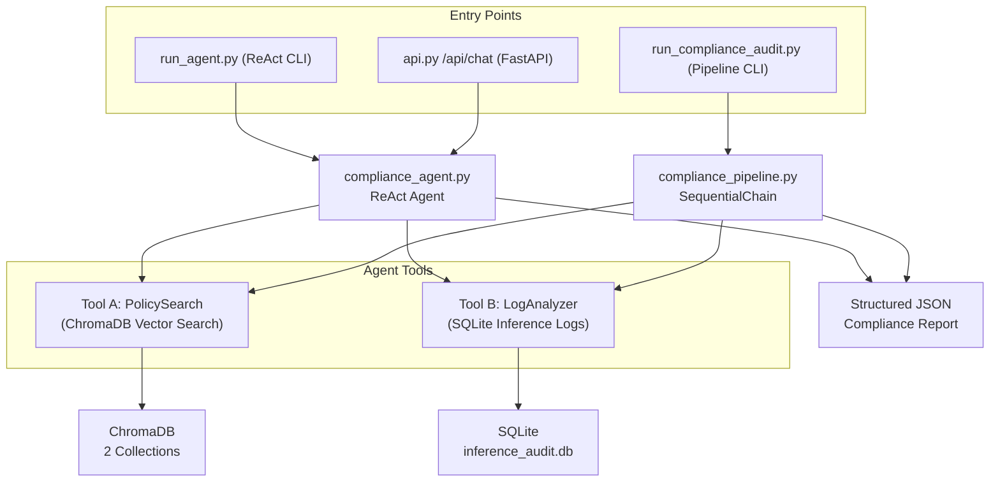
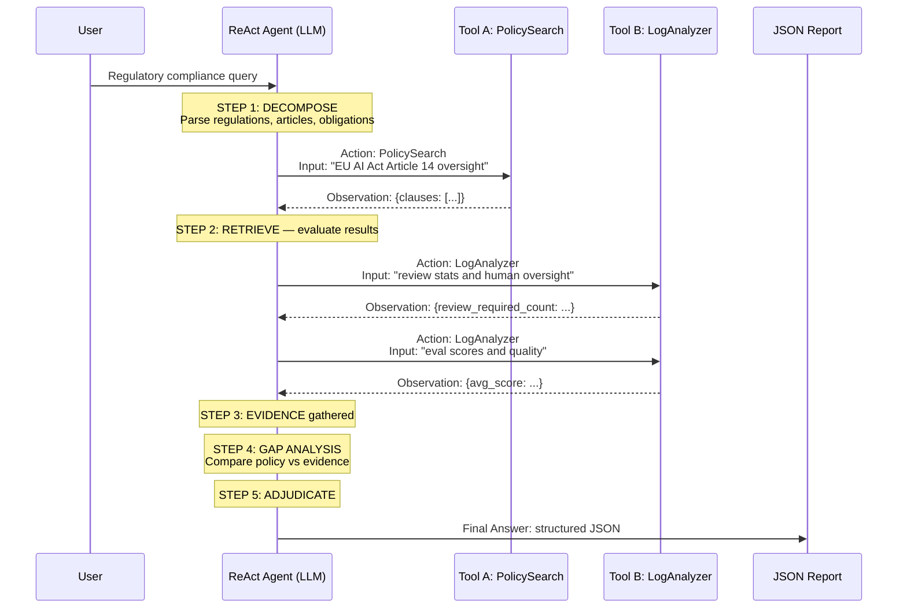
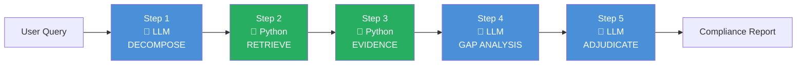
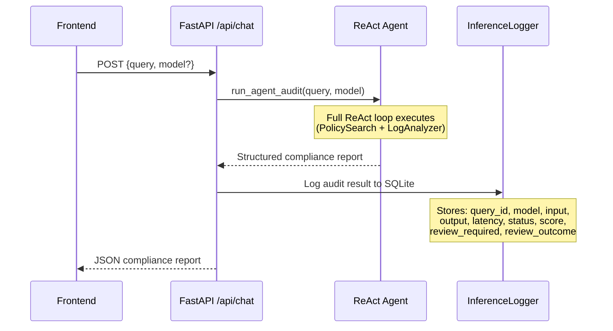
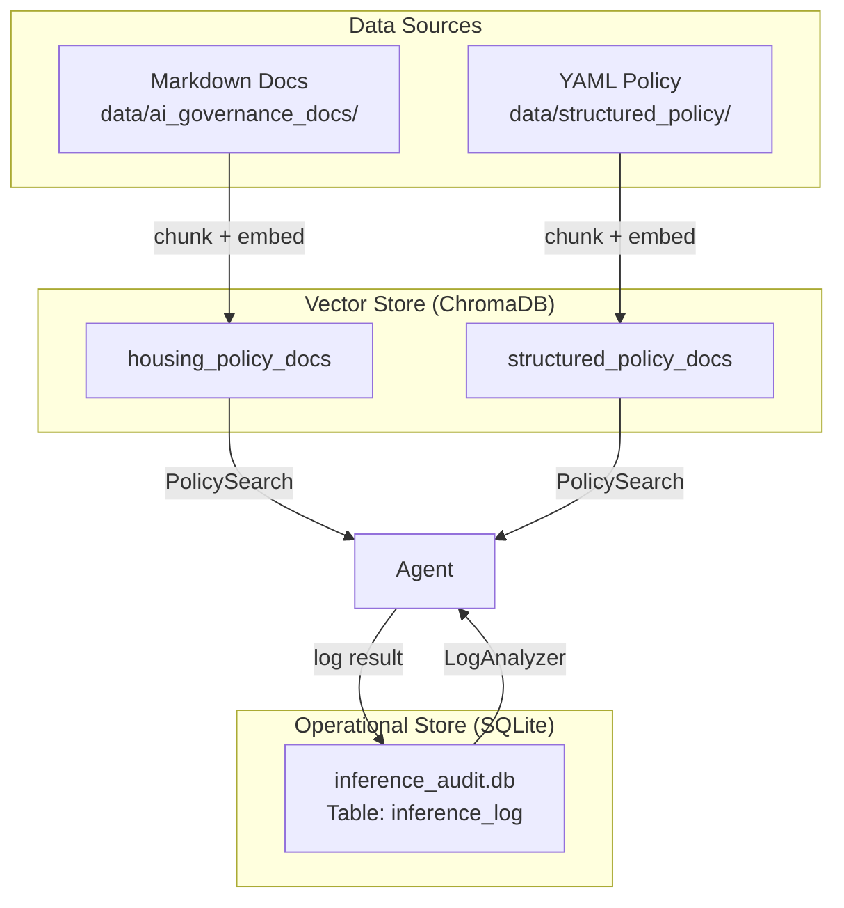

# GovernedRAG — Agent Architecture Deep Dive

A detailed breakdown of every agent component, data flow, and execution stage in the GovernedRAG system.

---

## System Overview

GovernedRAG uses a **dual-mode agent architecture** — a ReAct agent (autonomous) and a SequentialChain pipeline (deterministic) — to perform AI compliance audits. Both share the same tools and data stores, but differ in execution control.



---

## Phase 1: Data Ingestion & Traceability Layer

Before any audit occurs, the system ingests regulatory frameworks and establishes an immutable audit trail.

**Vector Store (ChromaDB):** Houses two distinct collections: `housing_policy_docs` (unstructured markdown) and `structured_policy_docs` (YAML extracts). Documents are chunked contextually, with strict provenance metadata (source, section, chunk ID) maintained for every token.

**Operational Store (SQLite):** The `inference_audit.db` logs every user query, AI response, latency, evaluation score, and human-review flag, serving as the ground-truth database for operational reliability metrics.

---

## Phase 2: Agent Tools (Shared by Both Modes)

> **File**: [retrieval_tools.py](file:///Users/newusername/Desktop/RAIT_Assesment/GovernedRAG/retrieval_tools.py)

Two LangChain `Tool` objects callable by the agent. **All computation is deterministic — no LLM involvement in these tools.**

### Tool A — PolicySearch

```
Name: "PolicySearch"
Function: _policy_search(query: str) → JSON string
```

**What it does:**
1. Accepts a natural-language regulatory query
2. Searches **both** ChromaDB collections (`housing_policy_docs` + `structured_policy_docs`)
3. Applies a **distance threshold** of `0.85` — only semantically relevant results pass
4. Deduplicates by `chunk_id`, sorts by distance (relevance)
5. Returns up to 10 clauses with full provenance: `text`, `source_file`, `section`, `document_category`, `distance`

**Fallback**: If 0 results pass the threshold, returns a structured warning with suggestions to broaden the query.

### Tool B — LogAnalyzer

```
Name: "LogAnalyzer"
Function: _log_analyzer(query: str) → JSON string
```

**What it does:**
1. Accepts a natural-language query about operational logs
2. Applies **synonym mapping** (e.g., "response speed" → "latency", "reliability" → "error rate")
3. Routes to one of **8 deterministic operations** via keyword matching:

| Keyword | Operation | Output |
|---|---|---|
| `sample`, `show me` | `sample_queries` | N sample log entries |
| `latency`, `avg latency` | `avg_latency` | Mean/min/max/p95 latency |
| `error rate`, `error` | `error_rate` | Error count + HTTP status breakdown |
| `filter`, `category` | `filter_by_category` | Logs filtered by policy category |
| `review`, `pending`, `oversight` | `review_stats` | Human review statistics |
| `eval`, `score`, `quality` | `eval_scores` | Evaluation score distribution |
| `recent`, `latest` | `recent_logs` | N most recent entries |
| *(default)* | `summary` | Full statistical breakdown |

4. Every response injects `_metadata` with `computation_method`, `sample_size`, `time_range`, `db_path`

**Data Source**: SQLite `inference_audit.db` via [inference_logger.py](file:///Users/newusername/Desktop/RAIT_Assesment/GovernedRAG/embedding_pipeline/inference_logger.py)

---

## Phase 3 (Mode A): ReAct Agent — Autonomous Execution

> **File**: [compliance_agent.py](file:///Users/newusername/Desktop/RAIT_Assesment/GovernedRAG/compliance_agent.py)

### Architecture



### 5-Step Reasoning Protocol (embedded in system prompt)

| Step | What Happens | Who Does It |
|---|---|---|
| **1. DECOMPOSE** | Parse query → regulations, articles, obligations, intent | LLM (in-prompt reasoning) |
| **2. RETRIEVE** | Call PolicySearch one or more times | LLM decides → Tool A executes |
| **3. EVIDENCE** | Call LogAnalyzer one or more times | LLM decides → Tool B executes |
| **4. GAP ANALYSIS** | Compare policy requirements vs evidence metrics | LLM (in-prompt reasoning) |
| **5. ADJUDICATE** | Produce final compliance determination | LLM → structured JSON output |

### Key Constraints (in System Prompt)

- **Must call BOTH tools** before producing the final answer
- **Never fabricate or assume metrics** — use only exact values from LogAnalyzer
- `review_required=True` is a **positive** oversight signal, not a failure
- `pending_count` is the **actual** oversight gap
- `error_rate` measures HTTP reliability, NOT oversight quality

### Agent Configuration

| Parameter | Value | Purpose |
|---|---|---|
| `model_name` | `llama-3.3-70b-versatile` | Groq LLM |
| `temperature` | `0.1` | Near-deterministic outputs |
| `max_iterations` | `10` | Max tool-call loops |
| `max_execution_time` | `120s` | 2-minute timeout |
| `handle_parsing_errors` | `True` | Graceful error recovery |
| `return_intermediate_steps` | `True` | Full tool-call trace captured |

### Builder Function

[build_compliance_agent](file:///Users/newusername/Desktop/RAIT_Assesment/GovernedRAG/compliance_agent.py#L140-L186) creates:
1. `ChatGroq` LLM instance
2. `create_react_agent(llm, tools, prompt)` — LangChain ReAct agent
3. `AgentExecutor` — wraps agent with error handling, iteration limits, timeout

### Execution Loop

[run_agent_audit](file:///Users/newusername/Desktop/RAIT_Assesment/GovernedRAG/compliance_agent.py#L193-L270):
1. Generates deterministic `audit_id` and `timestamp` in Python (never trusts LLM)
2. Invokes `executor.invoke({"input": query})`
3. Parses JSON from agent's `Final Answer`
4. Injects audit metadata into the report
5. Captures full **tool-call trace** (tool name, input, output preview)

---

## Phase 3 (Mode B): SequentialChain — Deterministic Pipeline

> **File**: [compliance_pipeline.py](file:///Users/newusername/Desktop/RAIT_Assesment/GovernedRAG/compliance_pipeline.py)

### Architecture



### Step-by-Step Breakdown

#### Step 1 — Decompose Query (LLM)
- **Type**: `LLMChain`
- **Input**: `user_query`
- **Output**: `step_1_decomposition` (JSON)
- Extracts: `regulations`, `articles`, `obligations`, `system_context`, `query_intent`

#### Step 2 — Retrieve Policy Clauses (Pure Python)
- **Type**: `TransformChain`
- **Input**: `step_1_decomposition` + `user_query`
- **Output**: `step_2_retrieved_clauses` (JSON)
- Builds search queries from Step 1's decomposition (obligations × regulations)
- Searches both ChromaDB collections (up to 5 queries, 3+2 results each)
- Deduplicates and applies distance threshold `0.85`
- Returns up to 15 unique clauses

#### Step 3 — Compute Evidence (Pure Python)
- **Type**: `TransformChain`
- **Input**: `step_2_retrieved_clauses`
- **Output**: `step_3_evidence_metrics` (JSON)
- Reads all inference logs from SQLite
- Computes deterministically:
  - Latency stats (avg, min, max, p95)
  - HTTP error rate + status breakdown
  - Evaluation score stats
  - Human review stats (review_required count, pending count)
  - Policy category breakdown + model versions
- Injects an **evidence interpretation guide** to prevent LLM misinterpretation

#### Step 4 — Gap Analysis (LLM)
- **Type**: `LLMChain`
- **Input**: Steps 1 + 2 + 3
- **Output**: `step_4_gap_analysis` (JSON)
- Prompt includes **critical metric semantics** to prevent common misinterpretations
- For each obligation: assesses `compliant`, `partial`, `non_compliant`, or `insufficient_data`
- Counts overall gaps and critical gaps

#### Step 5 — Adjudicate (LLM)
- **Type**: `LLMChain`
- **Input**: All previous steps + original query
- **Output**: `step_5_adjudication` (JSON)
- Produces: `overall_status`, `confidence_score`, `summary`, `citations`, `recommendations`
- `audit_id` and `timestamp` are injected by Python after LLM returns (never LLM-generated)

### Key Difference from ReAct Mode

| Aspect | ReAct Agent | SequentialChain |
|---|---|---|
| **Control flow** | LLM decides tool order & count | Fixed 5-step chain |
| **Step skipping** | Possible (mitigated by prompt) | Impossible |
| **Tool calls** | Dynamic (1–N per tool) | Exactly 1 search per step |
| **Flexibility** | Can re-query if results are poor | No re-querying |
| **Traceability** | Tool-call trace logged | Step-by-step outputs logged |
| **Pipeline version** | `3.0.0` | `1.1.0` |

---

## Phase 4: Governance Metrics (Dashboard Layer)

> **File**: [governance_metrics.py](file:///Users/newusername/Desktop/RAIT_Assesment/GovernedRAG/governance_metrics.py)

4 deterministic metrics computed purely in Python (no LLM). Organized in two monitoring layers. Metrics 2, 3 use BGE-M3 embeddings.

> 8 metrics across 5 monitoring layers. Metrics 2, 3, 5 use BGE-M3 embeddings.

### Layer 1 — User Query Monitoring (Data Source: User Queries)

| # | Metric | Full Name | Formula | Requires Embeddings |
|---|---|---|---|---|
| 1 | **RECI** | Risk Exposure Concentration Index | Σ f_risk(q) / \|Q_t\| | No |
| 2 | **UQRR** | Unresolved Query Recurrence Rate | \|{(q_i,q_j): CosineSim(E(q_i),E(q_j)) ≥ θ}\| / \|Q\| | Yes |

### Layer 2 — LLM Behaviour Monitoring (Data Source: LLM Responses)

| # | Metric | Full Name | Formula | Requires Embeddings |
|---|---|---|---|---|
| 3 | **BDI** | Behavioural Drift Index | 1 − CosineSim(C_t, C_base) | Yes |
| 4 | **OCR** | Overcommitment Ratio | Σ 1(R_i ∈ D) / N | No |

### Report Assessment Thresholds

| Metric | GREEN (Safe) | AMBER (Warning) | RED (Critical) | Direction |
|---|---|---|---|---|
| RECI | ≤ 10% | ≤ 25% | > 25% | Lower is better |
| UQRR | ≤ 10% | ≤ 25% | > 25% | Lower is better |
| BDI | ≤ 0.10 | ≤ 0.20 | > 0.20 | Lower is better |
| OCR | ≤ 5% | ≤ 15% | > 15% | Lower is better |

### Layer 3 — Model Version & Inference Monitoring (Data Source: Model Client API)

| # | Metric | Full Name | Formula | Requires Embeddings |
|---|---|---|---|---|
| 5 | **VID** | Version Impact Deviation | 1 − CosineSim(C_old, C_new) | Yes |

### Layer 4 — Human Evaluation Monitoring (Data Source: Ground Truth)

| # | Metric | Full Name | Formula | Requires Embeddings |
|---|---|---|---|---|
| 6 | **MDR** | Monitoring Depth Ratio | N_reviewed / N_total | No |

### Layer 5 — Operational Reliability Monitoring (Data Source: System Metrics)

| # | Metric | Full Name | Formula | Requires Embeddings |
|---|---|---|---|---|
| 7 | **OVI** | Operational Volatility Index | σ_L / μ_L | No |
| 8 | **ETBR** | Escalation Threshold Breach Rate | Σ 1(E_t > τ) / N_total | No |

### Full Threshold Table

| Metric | GREEN (Safe) | AMBER (Warning) | RED (Critical) | Direction |
|---|---|---|---|---|
| RECI | ≤ 10% | ≤ 25% | > 25% | Lower is better |
| UQRR | ≤ 10% | ≤ 25% | > 25% | Lower is better |
| BDI | ≤ 0.10 | ≤ 0.20 | > 0.20 | Lower is better |
| OCR | ≤ 5% | ≤ 15% | > 15% | Lower is better |
| VID | ≤ 0.10 | ≤ 0.20 | > 0.20 | Lower is better |
| MDR | ≥ 70% | ≥ 50% | < 50% | Higher is better |
| OVI | ≤ 0.30 | ≤ 0.50 | > 0.50 | Lower is better |
| ETBR | ≤ 5% | ≤ 10% | > 10% | Lower is better |

---

## Phase 5: API Layer — Connecting Everything

> **File**: [api.py](file:///Users/newusername/Desktop/RAIT_Assesment/GovernedRAG/api.py)

### Endpoint Map

| Method | Path | Handler | What It Does |
|---|---|---|---|
| `GET` | `/api/metrics` | `get_metrics()` | All 8 governance metrics (with embeddings) |
| `GET` | `/api/metrics/fast` | `get_metrics_fast()` | 5 non-embedding metrics (RECI, OCR, MDR, OVI, ETBR) |
| `GET` | `/api/logs` | `get_logs()` | All inference log entries |
| `POST` | `/api/query` | `policy_search()` | PolicySearch on vector DB |
| `POST` | `/api/chat` | `chat()` | **ReAct agent** compliance audit |
| `GET` | `/api/report` | `generate_report()` | Full compliance report (metrics + logs) |

### `/api/chat` Flow (The Main Agent Endpoint)



**After each audit, the API logs**:
- `query_id` = audit_id from the report
- `review_required` = `True` if status ≠ `COMPLIANT`
- `review_outcome` = `"pending"` if non-compliant, `"auto_approved"` otherwise
- `evaluation_score` = agent's confidence score

---

## Data Architecture



### SQLite Schema: `inference_log`

| Column | Type | Purpose |
|---|---|---|
| `query_id` | TEXT PK | Unique identifier |
| `model_version` | TEXT | LLM model used |
| `user_input` | TEXT | User's query |
| `llm_output` | TEXT | Agent's response |
| `timestamp` | TEXT | ISO 8601 |
| `latency_ms` | INTEGER | Response time |
| `http_status` | INTEGER | HTTP status code |
| `evaluation_status` | TEXT | Status of evaluation |
| `evaluation_score` | REAL | Quality score (0.0–1.0) |
| `review_required` | BOOLEAN | Flagged for human review? |
| `review_outcome` | TEXT | pending / auto_approved / reviewed |
| `policy_category` | TEXT | eu_ai_act, gdpr, nist_ai_rmf, etc. |
| `ground_truth` | TEXT | Human-labeled reference |
| `evaluation_timestamp` | TEXT | When evaluation occurred |

---

## Output Structure

Both modes produce the same structured JSON report:

```json
{
  "audit_metadata": {
    "audit_id": "AUDIT-20260225-150000",
    "query": "Is the system compliant with EU AI Act?",
    "model": "llama-3.3-70b-versatile",
    "timestamp": "2026-02-25T15:00:00Z",
    "pipeline_version": "3.0.0",
    "execution_mode": "react_agent",
    "tools_called": 3
  },
  "agent_tool_trace": [
    {"tool": "PolicySearch", "input": "...", "output_preview": "..."},
    {"tool": "LogAnalyzer", "input": "...", "output_preview": "..."}
  ],
  "compliance_report": {
    "step_1_decomposition": { "regulations": [...], "articles": [...] },
    "step_2_policy_clauses_summary": "...",
    "step_3_evidence_summary": "...",
    "step_4_gap_analysis": { "gaps": [...], "critical_gaps": 0 },
    "step_5_adjudication": {
      "overall_status": "PARTIALLY_COMPLIANT",
      "confidence_score": 0.82,
      "summary": "...",
      "citations": [...],
      "recommendations": [...]
    }
  }
}
```

---

## Execution Entrypoints Summary

| Entrypoint | Mode | What It Runs |
|---|---|---|
| `python run_agent.py "query"` | CLI | ReAct agent → saves to `audit/latest_agent_report.json` |
| `python run_compliance_audit.py "query"` | CLI | SequentialChain → saves to `audit/latest_compliance_report.json` |
| `POST /api/chat` | API | ReAct agent → returns JSON + logs to SQLite |
| `python run_pipeline.py` | CLI | Embedding pipeline (ingestion, not audit) |
| `python governance_metrics.py` | CLI | Compute all 8 metrics independently |
