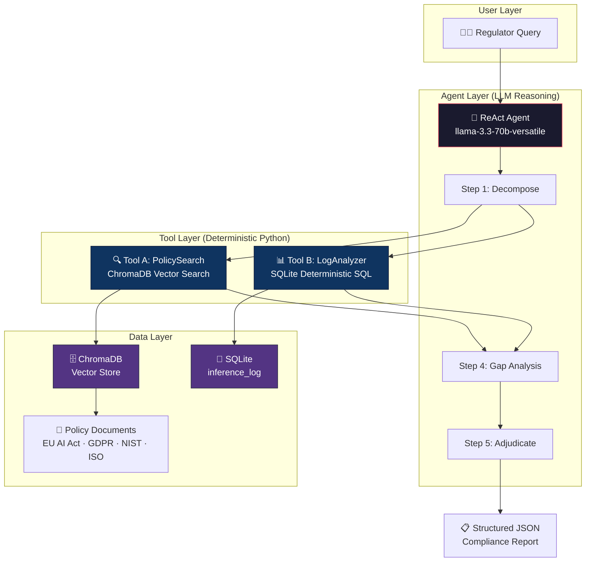
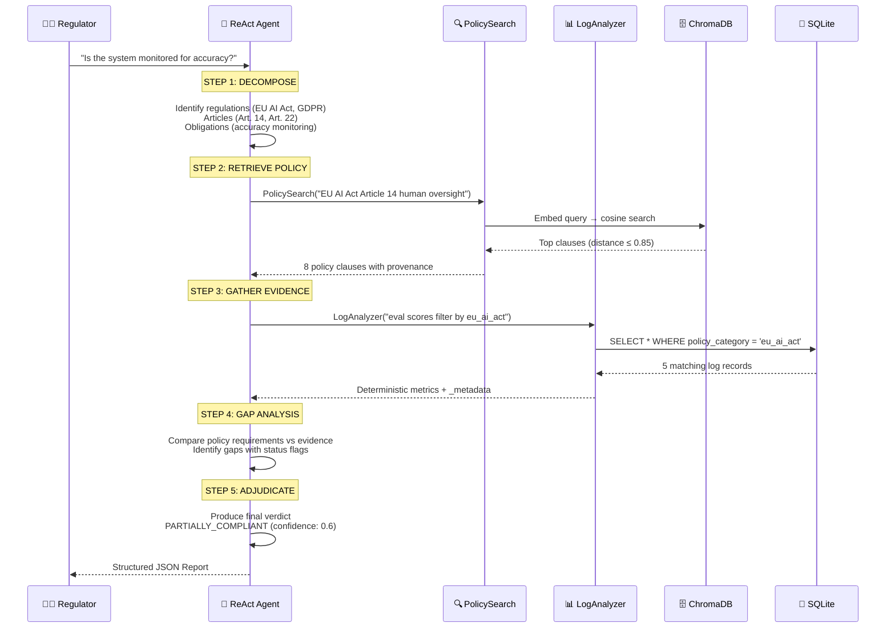
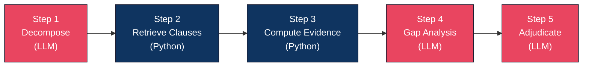
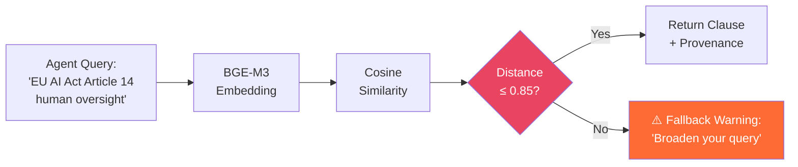
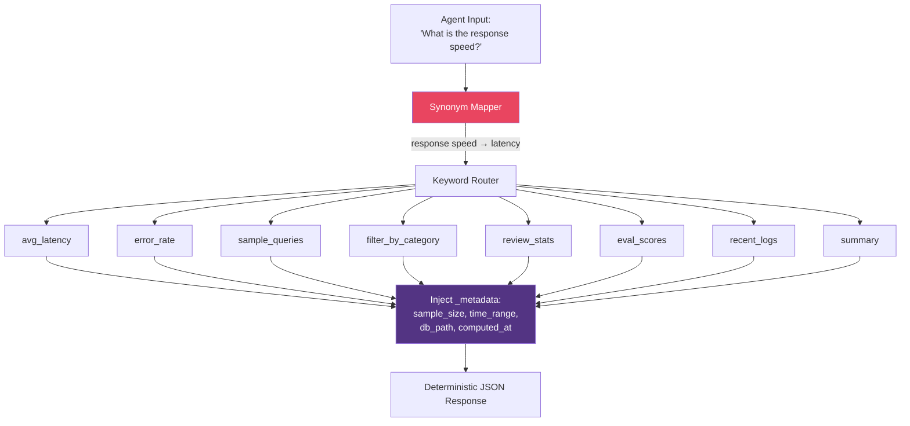
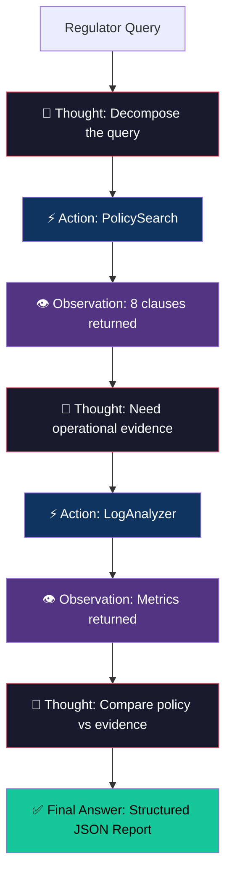
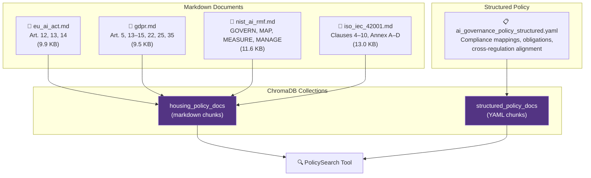
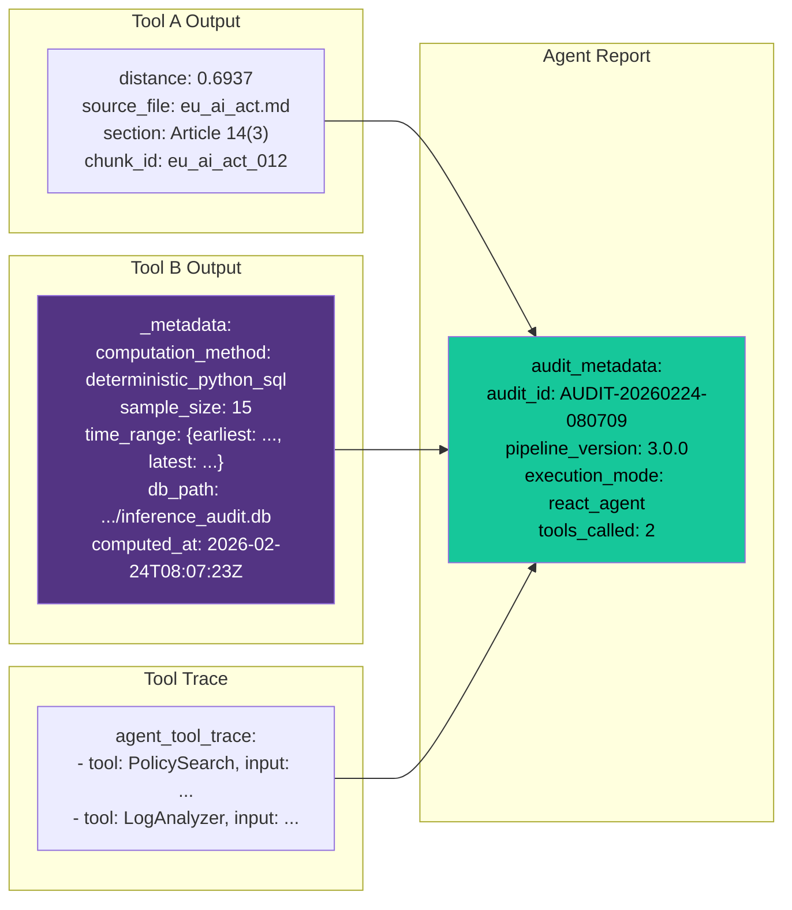

# GovernedRAG — AI Governance Compliance Audit Pipeline

> **A deterministic, auditable compliance reasoning system** that uses a ReAct agent with structured retrieval tools to assess AI systems against EU AI Act, GDPR, NIST AI RMF, and ISO/IEC 42001 regulations.

---

## Table of Contents

- [Architecture Overview](#architecture-overview)
- [End-to-End Workflow](#end-to-end-workflow)
- [Phase 1 — Sequential Reasoning Chain](#phase-1--sequential-reasoning-chain)
- [Phase 2 — Retrieval Tools](#phase-2--retrieval-tools)
- [Phase 3 — ReAct Agent Execution Loop](#phase-3--react-agent-execution-loop)
- [Policy Document Knowledge Base](#policy-document-knowledge-base)
- [Metadata Injection & Audit Traceability](#metadata-injection--audit-traceability)
- [Project Structure](#project-structure)
- [Setup & Installation](#setup--installation)
- [Usage](#usage)

---

## Architecture Overview

GovernedRAG enforces a strict separation between **LLM reasoning** and **deterministic data retrieval/computation**. The LLM never computes metrics or fetches documents directly — it calls specialized tools that return auditable, reproducible results.



### Key Design Principles

| Principle | How It's Enforced |
|-----------|-------------------|
| **Determinism** | Steps 2 & 3 are pure Python — the LLM NEVER computes metrics |
| **Auditability** | Every tool response includes `_metadata` (sample_size, time_range, db_path) |
| **Traceability** | The agent's tool call trace is captured and included in the final report |
| **No Hallucination** | Distance threshold (0.85) filters irrelevant retrieval; synonym mapper prevents misrouting |
| **Structured Output** | Final report is a machine-parseable JSON with citations and reasoning trace |

---

## End-to-End Workflow

Here is the complete journey of a compliance query through the system:



### Example: What Happens with "Is the system monitored for accuracy?"

| Step | What the Agent Does | Tool Called | Result |
|------|---------------------|-------------|--------|
| **1. Decompose** | Parses query → EU AI Act Art. 14, GDPR Art. 22 | — | Regulations, obligations identified |
| **2. Retrieve Policy** | Searches for human oversight & accuracy clauses | `PolicySearch` | 8 clauses from `eu_ai_act.md`, `ai_governance_policy_structured.yaml` |
| **3. Gather Evidence** | Filters inference logs by `eu_ai_act` category | `LogAnalyzer` | 5 logs, eval scores 0.0–0.92, 3/5 flagged for review |
| **4. Gap Analysis** | Finds review_required is inconsistent across logs | — | 1 gap identified, status: `partial` |
| **5. Adjudicate** | Final determination | — | `PARTIALLY_COMPLIANT`, confidence 0.6 |

---

## Phase 1 — Sequential Reasoning Chain

> **File:** `compliance_pipeline.py` · **CLI:** `run_compliance_audit.py`

The original Phase 1 implementation uses a **LangChain SequentialChain** that hardcodes the 5-step process:



- **Red** = LLM steps (reasoning)
- **Blue** = Python steps (deterministic computation)

### Quality Hardening Applied

1. **Distance Threshold (0.85)** — Filters out semantically irrelevant chunks before passing to the LLM
2. **Evidence Interpretation Guide** — Step 3 injects plain-English metric semantics to prevent the LLM from misinterpreting metrics like `review_required` or `auto_approved`
3. **Corrected Step 4 Prompt** — Explicit rules about what each metric actually means
4. **Python-Generated Audit Metadata** — `audit_id` and `timestamp` are generated by Python, never by the LLM

---

## Phase 2 — Retrieval Tools

> **File:** `retrieval_tools.py`

Two LangChain-compatible tools that wrap deterministic data access:

### Tool A: `PolicySearch` — ChromaDB Vector Search



**What it returns:**
```json
{
  "query": "EU AI Act Article 14 human oversight",
  "total_results": 8,
  "distance_threshold": 0.85,
  "clauses": [
    {
      "text": "Oversight measures shall be commensurate with...",
      "source_file": "eu_ai_act.md",
      "section": "Article 14(3): Oversight Measures",
      "document_category": "eu_regulation",
      "chunk_id": "eu_ai_act_012",
      "distance": 0.6937
    }
  ]
}
```

**Fallback Strategy:** If 0 results pass the threshold, the tool returns:
> *"No specific regulatory matches found within the distance threshold (0.85). Please broaden the compliance query or use more specific regulatory terminology."*

---

### Tool B: `LogAnalyzer` — SQLite Deterministic Analysis

Supports 8 analysis operations, routed via **keyword matching + synonym mapping**:



**Synonym Map (30+ mappings):**

| LLM Says | Routed To |
|----------|-----------|
| "response speed", "response time", "delay" | `latency` |
| "failure rate", "reliability", "uptime" | `error_rate` |
| "human oversight", "manual review", "pending approval" | `review` |
| "quality score", "accuracy", "performance score" | `eval` |
| "examples", "show queries" | `sample` |

---

## Phase 3 — ReAct Agent Execution Loop

> **File:** `compliance_agent.py` · **CLI:** `run_agent.py`

The Phase 3 agent replaces the hardcoded SequentialChain with a **ReAct (Reasoning + Acting)** loop. The LLM autonomously decides when and how to call the tools.



### ReAct Format

The agent uses the standard ReAct parsing format:

```
Thought: I need to find relevant policy clauses for EU AI Act Article 14
Action: PolicySearch
Action Input: EU AI Act Article 14 human oversight
Observation: {"total_results": 8, "clauses": [...]}

Thought: Now I need operational evidence from the inference logs
Action: LogAnalyzer
Action Input: eval quality score filter by eu_ai_act
Observation: {"operation": "filter_by_category", "total_matching": 5, ...}

Thought: I now have enough information to perform gap analysis and adjudicate
Final Answer: {"step_1_decomposition": {...}, ...}
```

### Why ReAct Over SequentialChain?

| Feature | Phase 1 (SequentialChain) | Phase 3 (ReAct Agent) |
|---------|--------------------------|----------------------|
| Tool calling | Hardcoded order | Agent decides autonomously |
| Multiple tool calls | Fixed (1 per step) | Dynamic (can call PolicySearch 3x) |
| Adaptive reasoning | No — same flow every time | Yes — adjusts strategy per query |
| Error recovery | Fails on unexpected input | Agent can retry with different input |
| Observability | Step outputs only | Full Thought/Action/Observation trace |

---

## Policy Document Knowledge Base

The system's regulatory knowledge comes from 4 authoritative documents embedded in ChromaDB:



### How Policy Documents Help

Each document serves a specific role in the compliance assessment:

| Document | Regulation | Key Coverage | Used For |
|----------|------------|-------------|----------|
| `eu_ai_act.md` | EU AI Act | Record-keeping (Art. 12), Transparency (Art. 13), Human Oversight (Art. 14) | Mandatory compliance checks for EU-deployed AI |
| `gdpr.md` | GDPR | Data protection, automated decision-making (Art. 22), DPIAs (Art. 35) | Privacy & data rights assessment |
| `nist_ai_rmf.md` | NIST AI RMF | GOVERN, MAP, MEASURE, MANAGE functions | US risk management framework alignment |
| `iso_iec_42001.md` | ISO/IEC 42001 | AI management system clauses, Annex A–D controls | International standards compliance |
| `ai_governance_policy_structured.yaml` | Cross-regulation | Compliance mappings, obligation breakdowns, timeline requirements | Cross-framework gap identification |

### Cross-Regulation Mapping

The structured YAML policy provides critical **cross-framework alignment**:

```
EU AI Act Article 14 ↔ GDPR Article 22(3) ↔ ISO 42001 Clause 8.4 ↔ NIST MS-2.7
```

This allows the agent to identify that a query about "human oversight" (EU AI Act) is also relevant to "right to human intervention" (GDPR) and "lifecycle monitoring" (ISO 42001).

---

## Metadata Injection & Audit Traceability

Every response from the system includes rich metadata to ensure audit traceability. Here is how metadata flows through the system:



### What Metadata Is Injected and Why

| Metadata Field | Source | Purpose |
|---------------|--------|---------|
| `_metadata.sample_size` | Tool B (Python) | Tells the auditor if `avg_latency: 1307ms` is based on 5 queries or 5,000 |
| `_metadata.time_range` | Tool B (Python) | Shows the temporal window of the evidence (not just a snapshot) |
| `_metadata.db_path` | Tool B (Python) | Points to the exact SQLite database for independent verification |
| `_metadata.computation_method` | Tool B (Python) | Confirms metrics were computed deterministically, not by LLM |
| `audit_id` | Python wrapper | Generated by `datetime`, never by the LLM (prevents hallucinated IDs) |
| `pipeline_version` | Python wrapper | Tracks which version of the pipeline produced this report |
| `agent_tool_trace` | AgentExecutor | Records every tool call the agent made, with inputs and output previews |
| `distance` | Tool A (ChromaDB) | Quantifies how semantically close each retrieved clause is to the query |

### Evidence Interpretation Guide

Step 3 of the pipeline injects a plain-English interpretation guide to prevent the LLM from misreading metrics:

```json
{
  "evidence_interpretation_guide": {
    "review_required_meaning": "review_required=True means the system CORRECTLY flagged outputs for human review — a HIGH rate is a POSITIVE oversight signal",
    "auto_approved_meaning": "auto_approved means low-risk outputs passed automated evaluation — this is compliant behaviour",
    "pending_review_meaning": "2 reviews are currently PENDING human action — these represent an ACTUAL oversight gap",
    "error_rate_meaning": "error_rate_percent measures system reliability (HTTP 4xx/5xx), NOT oversight quality",
    "eval_score_meaning": "evaluation_score measures output quality (0.0–1.0). Scores below 0.70 should trigger mandatory human review"
  }
}
```

---

## Project Structure

```
GovernedRAG/
├── compliance_agent.py          # Phase 3: ReAct agent execution loop
├── compliance_pipeline.py       # Phase 1: SequentialChain (5-step)
├── retrieval_tools.py           # Phase 2: PolicySearch + LogAnalyzer tools
├── run_agent.py                 # CLI for Phase 3 agent
├── run_compliance_audit.py      # CLI for Phase 1 pipeline
├── seed_test_data.py            # Seeds 15 sample inference_log records
├── requirements.txt             # Python dependencies
├── .env                         # GROQ_API_KEY (gitignored)
│
├── data/
│   ├── ai_governance_docs/      # Regulatory source documents
│   │   ├── eu_ai_act.md         #   EU AI Act Articles 12, 13, 14
│   │   ├── gdpr.md              #   GDPR key governance articles
│   │   ├── iso_iec_42001.md     #   ISO/IEC 42001 AI management system
│   │   └── nist_ai_rmf.md      #   NIST AI Risk Management Framework
│   └── structured_policy/       # Machine-readable policy YAML
│       └── ai_governance_policy_structured.yaml
│
├── embedding_pipeline/          # Document processing & storage
│   ├── vector_store.py          #   ChromaDB manager (embed, upsert, query)
│   ├── inference_logger.py      #   SQLite inference_log schema & logger
│   ├── document_loader.py       #   Markdown/YAML document loader
│   ├── chunker.py               #   Section-aware text chunking
│   ├── audit_logger.py          #   Embedding audit trail
│   └── traceability.py          #   Document provenance tracking
│
├── audit/                       # Output directory
│   ├── latest_agent_report.json     # Phase 3 agent output
│   ├── latest_compliance_report.json # Phase 1 pipeline output
│   ├── inference_audit.db           # SQLite inference logs
│   └── embedding_audit.db          # SQLite embedding audit trail
│
└── vector_store/                # ChromaDB persistent storage
```

---

## Setup & Installation

### Prerequisites
- Python 3.9+
- A [Groq API key](https://console.groq.com/)

### Installation

```bash
# Clone the repository
git clone https://github.com/yash-ganatra/GovernedRAG.git
cd GovernedRAG

# Create virtual environment
python3 -m venv .venv
source .venv/bin/activate

# Install dependencies
pip install -r requirements.txt

# Configure API key
echo "GROQ_API_KEY=your_groq_api_key_here" > .env
```

### Seed Test Data

```bash
python seed_test_data.py
```

This populates the `inference_log` SQLite table with 15 realistic records across EU AI Act, GDPR, NIST AI RMF, and ISO 42001 categories.

---

## Usage

### Phase 3 — ReAct Agent (Recommended)

```bash
python run_agent.py "Is the system monitored for accuracy?"
```

```bash
python run_agent.py "Is our AI system compliant with EU AI Act Article 14 human oversight requirements?"
```

```bash
python run_agent.py "Does our ML pipeline satisfy GDPR Article 22 automated decision-making safeguards?"
```

### Phase 1 — Sequential Pipeline

```bash
python run_compliance_audit.py "Is our AI system compliant with EU AI Act Article 14 human oversight requirements?"
```

### Tool Testing

```bash
python retrieval_tools.py
```

---

## Environment Variables

| Variable | Default | Description |
|----------|---------|-------------|
| `GROQ_API_KEY` | — | Your Groq API key (required) |
| `GROQ_MODEL` | `llama-3.3-70b-versatile` | Groq model to use |

---

## Tech Stack

| Component | Technology |
|-----------|------------|
| LLM Provider | Groq API (`llama-3.3-70b-versatile`) |
| Agent Framework | LangChain (ReAct agent) |
| Vector Database | ChromaDB (persistent) |
| Embeddings | BGE-M3 (`BAAI/bge-m3`) |
| Structured Logging | SQLite (`inference_log` table) |
| Policy Documents | Markdown + YAML |
