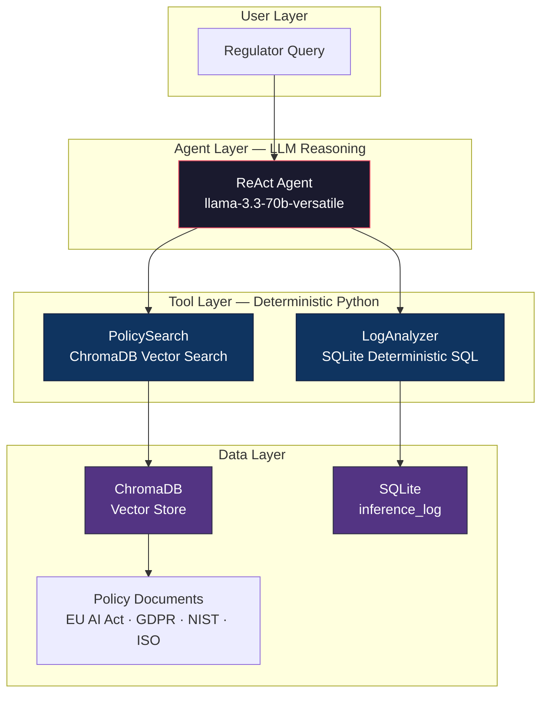

# GovernedRAG

> A deterministic, auditable compliance reasoning system that uses a ReAct agent with structured retrieval tools to assess AI systems against EU AI Act, GDPR, NIST AI RMF, and ISO/IEC 42001 regulations.

### 🚀 [Live Prototype → huggingface.co/spaces/yashganatra/RAI_Assessment](https://huggingface.co/spaces/yashganatra/RAI_Assessment)

---

## Architecture Overview

GovernedRAG enforces a strict separation between **LLM reasoning** and **deterministic data retrieval**. The LLM never computes metrics or fetches documents directly — it invokes specialized tools that return auditable, reproducible results.



| Principle | Enforcement |
|-----------|-------------|
| **Determinism** | Retrieval and metric computation are pure Python — the LLM never computes metrics |
| **Auditability** | Every tool response includes `_metadata` (sample size, time range, db path, computation method) |
| **Traceability** | The agent's full tool-call trace is captured and embedded in the final report |
| **No Hallucination** | Distance threshold (0.85) filters irrelevant retrieval; synonym mapper prevents misrouting |
| **Structured Output** | Final report is machine-parseable JSON with citations and reasoning trace |

---

## Agent Architecture

GovernedRAG supports two execution modes — a **ReAct Agent** (autonomous) and a **SequentialChain** (deterministic) — sharing the same tools and data stores.

### ReAct Agent — Autonomous Execution

The ReAct agent follows a **Thought → Action → Observation** loop with a 5-step reasoning protocol embedded in its system prompt:

| Step | Action | Executor |
|------|--------|----------|
| **1. Decompose** | Parse query into regulations, articles, and obligations | LLM |
| **2. Retrieve** | Search policy knowledge base via `PolicySearch` | Tool A (ChromaDB) |
| **3. Evidence** | Gather operational metrics via `LogAnalyzer` | Tool B (SQLite) |
| **4. Gap Analysis** | Compare policy requirements against evidence | LLM |
| **5. Adjudicate** | Produce compliance verdict with confidence score | LLM |

The agent autonomously decides tool invocation order and frequency. It can call `PolicySearch` multiple times if initial results are insufficient, and can query `LogAnalyzer` across different operations (latency, error rate, review stats) as needed.

**Agent Configuration:**  `temperature=0.1` · `max_iterations=10` · `timeout=120s` · `handle_parsing_errors=True`

### SequentialChain — Deterministic Pipeline

A fixed 5-step LangChain `SequentialChain` that executes the same reasoning protocol in a hardcoded order. Steps 2 and 3 are `TransformChain` nodes (pure Python), while steps 1, 4, and 5 are `LLMChain` nodes.

| Aspect | ReAct Agent | SequentialChain |
|--------|-------------|-----------------|
| Control flow | LLM decides tool order & count | Fixed 5-step chain |
| Tool calls | Dynamic (1–N per tool) | Exactly 1 per step |
| Adaptive reasoning | Adjusts strategy per query | Same flow every time |
| Error recovery | Retries with different input | Fails on unexpected input |

### Retrieval Tools

Both modes share two LangChain-compatible tools — all computation is deterministic with no LLM involvement:

**Tool A — PolicySearch** searches both ChromaDB collections (`housing_policy_docs` + `structured_policy_docs`), applies a distance threshold of `0.85`, deduplicates by `chunk_id`, and returns up to 10 clauses with full provenance (source file, section, distance). Returns a structured fallback warning if no results pass the threshold.

**Tool B — LogAnalyzer** accepts natural-language log queries, applies synonym mapping (30+ mappings, e.g. "response speed" → "latency"), and routes to one of 8 deterministic SQL operations: `avg_latency`, `error_rate`, `sample_queries`, `filter_by_category`, `review_stats`, `eval_scores`, `recent_logs`, `summary`. Every response injects `_metadata` with computation method, sample size, time range, and database path.

---

## Governance Metrics Matrix

8 metrics across 5 monitoring layers, computed deterministically in Python. Metrics using BGE-M3 embeddings are marked.

### Layer 1 — User Query Monitoring

| # | Metric | Full Name | Formula | Embeddings |
|---|--------|-----------|---------|:----------:|
| 1 | **RECI** | Risk Exposure Concentration Index | Σ f_risk(q) / \|Q_t\| | No |
| 2 | **UQRR** | Unresolved Query Recurrence Rate | \|{(q_i,q_j): CosineSim ≥ θ}\| / \|Q\| | Yes |

### Layer 2 — LLM Behaviour Monitoring

| # | Metric | Full Name | Formula | Embeddings |
|---|--------|-----------|---------|:----------:|
| 3 | **BDI** | Behavioural Drift Index | 1 − CosineSim(C_t, C_base) | Yes |
| 4 | **OCR** | Overcommitment Ratio | Σ 1(R_i ∈ D) / N | No |

### Layer 3 — Model Version & Inference Monitoring

| # | Metric | Full Name | Formula | Embeddings |
|---|--------|-----------|---------|:----------:|
| 5 | **VID** | Version Impact Deviation | 1 − CosineSim(C_old, C_new) | Yes |

### Layer 4 — Human Evaluation Monitoring

| # | Metric | Full Name | Formula | Embeddings |
|---|--------|-----------|---------|:----------:|
| 6 | **MDR** | Monitoring Depth Ratio | N_reviewed / N_total | No |

### Layer 5 — Operational Reliability Monitoring

| # | Metric | Full Name | Formula | Embeddings |
|---|--------|-----------|---------|:----------:|
| 7 | **OVI** | Operational Volatility Index | σ_L / μ_L | No |
| 8 | **ETBR** | Escalation Threshold Breach Rate | Σ 1(E_t > τ) / N_total | No |

### Thresholds

| Metric | GREEN (Safe) | AMBER (Warning) | RED (Critical) | Direction |
|--------|:------------:|:---------------:|:--------------:|-----------|
| RECI | ≤ 10% | ≤ 25% | > 25% | Lower is better |
| UQRR | ≤ 10% | ≤ 25% | > 25% | Lower is better |
| BDI | ≤ 0.10 | ≤ 0.20 | > 0.20 | Lower is better |
| OCR | ≤ 5% | ≤ 15% | > 15% | Lower is better |
| VID | ≤ 0.10 | ≤ 0.20 | > 0.20 | Lower is better |
| MDR | ≥ 70% | ≥ 50% | < 50% | Higher is better |
| OVI | ≤ 0.30 | ≤ 0.50 | > 0.50 | Lower is better |
| ETBR | ≤ 5% | ≤ 10% | > 10% | Lower is better |

---

## Project Structure

```
GovernedRAG/
├── agents/                          # Agent execution modes
│   ├── compliance_agent.py          #   ReAct agent execution loop
│   ├── compliance_pipeline.py       #   SequentialChain (5-step deterministic)
│   └── retrieval_tools.py           #   PolicySearch + LogAnalyzer tools
│
├── core/                            # Data ingestion & storage
│   ├── vector_store.py              #   ChromaDB manager (embed, upsert, query)
│   ├── inference_logger.py          #   SQLite inference_log schema & logger
│   ├── document_loader.py           #   Markdown/YAML document loader
│   ├── chunker.py                   #   Section-aware text chunking
│   ├── audit_logger.py              #   Embedding audit trail
│   └── traceability.py              #   Document provenance tracking
│
├── metrics/
│   └── governance_metrics.py        #   8 governance metrics computation
│
├── api/
│   └── server.py                    #   FastAPI endpoints (metrics, logs, reports)
│
├── scripts/                         #   CLI entrypoints & utilities
│   ├── run_agent.py                 #   ReAct agent CLI
│   ├── run_compliance_audit.py      #   SequentialChain CLI
│   ├── run_pipeline.py              #   Embedding pipeline (ingestion)
│   └── seed_test_data.py            #   Seed sample inference_log records
│
├── data/
│   ├── ai_governance_docs/          #   EU AI Act, GDPR, NIST AI RMF, ISO 42001
│   └── structured_policy/           #   Cross-regulation YAML mappings
│
├── frontend/                        #   Dashboard UI
├── audit/                           #   Output reports & databases
├── vector_store/                    #   ChromaDB persistent storage
├── requirements.txt
├── Dockerfile
└── .env                             #   GROQ_API_KEY (gitignored)
```

---

## Setup & Usage

### Prerequisites

- Python 3.9+
- [Groq API key](https://console.groq.com/)

### Installation

```bash
git clone https://github.com/yash-ganatra/GovernedRAG.git
cd GovernedRAG
python3 -m venv .venv && source .venv/bin/activate
pip install -r requirements.txt
echo "GROQ_API_KEY=your_key_here" > .env
```

### Run Compliance Audit

```bash
# ReAct Agent (recommended)
python scripts/run_agent.py "Is the system monitored for accuracy?"

# Deterministic Pipeline
python scripts/run_compliance_audit.py "Is our AI system compliant with EU AI Act Article 14?"
```

### Run Dashboard

```bash
python -m api.server
```

---

## Tech Stack

| Component | Technology |
|-----------|------------|
| LLM Provider | Groq API (`llama-3.3-70b-versatile`) |
| Agent Framework | LangChain (ReAct agent) |
| Vector Database | ChromaDB (persistent) |
| Embeddings | BGE-M3 (`BAAI/bge-m3`) |
| Structured Logging | SQLite (`inference_log`) |
| Policy Documents | Markdown + YAML |
| API | FastAPI |
| Deployment | Docker / HuggingFace Spaces |
